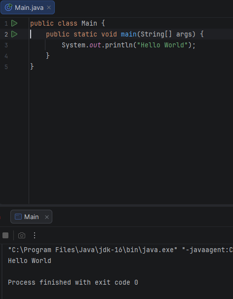

JDK version used : 
- Oracle Open JDK 16

Hello World Program Run:

Attached image:

Main Program:
public class Main {
    public static void main(String[] args) {
    System.out.println("Hello World");
    }
}

Brief Explanation:
- Main Class: The Class with the main method here.

- main method : Each program/project should always have a main method to begin execution.
This is the function from where the program execution always starts.

- public : This is an access modifier. It is public means the method can be accessed by anyone, hence be accessed by the complier.
- static: Only one main method would exist in a program. Also, no object would be required to call the main method since its static in nature.
- void : The main method is not supposed to return a value to the terminal once it runs completely.
- String args : Array of String objects. This is for any command line arguments passed to main before it starts.
- System.out.println() : Syntax to print in java. Comes from the java class java.lang